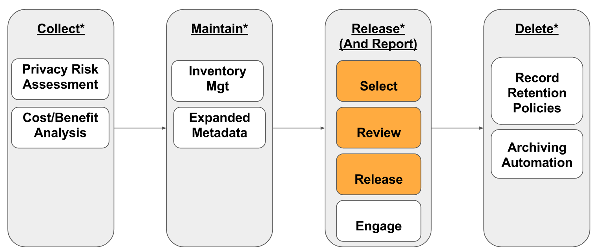

# Data Governance & Operational Guidelines
#### City of Asheville, NC

## Background
On October 13, 2015 the Asheville City Council adopted a [resolution](http://coablog.ashevillenc.gov/wp-content/uploads/2016/02/Resolution-No.-15-189.pdf) “directing the City Manager to establish an open data policy for the City of Asheville for sustaining public data availability using open data standards.” That resolution outlines high-level requirements for the City of Asheville's open data efforts. This effort allows us to go beyond minimal compliance with  [NC open records laws (NC General Statute Chapter 132)](https://www.ncga.state.nc.us/enactedlegislation/statutes/html/bychapter/chapter_132.html) to enhance the value of City data for the community.

The current site provides more detailed documentation on the implementation of the City's open data program following and building on the [initial technical plan](https://github.com/cityofasheville/open-data-portal-technical-plan-2016) published in October, 2016.

## Review of These Guidelines
The [open data policy](http://coablog.ashevillenc.gov/wp-content/uploads/2016/02/Resolution-No.-15-189.pdf) mandates that City staff report on open data policy implementation to the City Council Governance committee every six months through 2017 and annually thereafter. At minimum these guidelines are reviewed and updated by staff before each such report. The reports may be found [here](./governance-committee-reports.md).

That said, our intention is to continuously evaluate and improve our open data implementation and we invite public scrutiny and engagement at any time. __If you have a comment, suggestion, or criticism, please file an issue [here](https://github.com/cityofasheville/open-data-governance-and-ops-guidelines/issues)__.

## Open Data Maintenance Schedule
Publication of datasets on our open data infrastructure implies a commitment to maintaining their "integrity and usefulness" as directed by the City Council. In practical terms, this means that updates of the data occur automatically or as a regular part of a City process. In the vast majority of cases, datasets are updated automatically every night from internal City systems. In a few cases (such as the [annual proposed budget](http://data.ashevillenc.gov/datasets/6dbc7cc5c7614003a388a614124f00fb_1)), update is carried out on a less frequent schedule aligned with the actual purpose of the data.

## Data Standards
The City of Asheville is committed to using established standards wherever possible in order to support interoperability.

### API Standards
There is near-universal consensus that the current standard for the delivery of raw, machine-readable datasets is a [REST](https://en.wikipedia.org/wiki/Representational_state_transfer) (REpresentational State Transfer) application programming interface (API) that returns data in either a comma-separated-value (CSV) or a Javascript Object Notation (JSON) format. The REST API is commonly supplemented by the ability to simply download the dataset as a file in either of the above formats. The [City of Asheville open data portal](http://data.ashevillenc.gov/) supports both delivery methods and both formats.

The new [GraphQL standard](http://graphql.org/) released by Facebook in 2015 is seeing rapid adoption as a powerful alternative to REST that better reflects the relationships between different datasets, provides access to the underlying schema,  and offers greater control to data clients over what information should be delivered. We are building a second, parallel API to our open datasets at [https://data-api1.ashevillenc.gov/graphql](https://data-api1.ashevillenc.gov/graphql). That API server also supports the GraphiQL interactive exploration tool at [https://data-api1.ashevillenc.gov/graphiql](https://data-api1.ashevillenc.gov/graphiql).

### Data Standards
The use of common civic standards for common types of data such as [budget and spending](http://specs.frictionlessdata.io/fiscal-data-package/) or [permits](http://permitdata.org/) facilitates sharing and comparison of key data between different departments or between different governments. The City of Asheville is committed to providing standards-compliant versions of its data whenever possible.

The [Center for Government Excellence at Johns Hopkins University (GovEx)](https://govex.jhu.edu/) has published a [directory of open data standards](https://datastandards.directory/) used in government. These standards will be used to guide the development of our own internal data representation standards.

Providing standards-based versions of our data is a work in progress. For geographic information, all datasets adhere to modern open GIS standards. For most other datasets, we have prioritized the development and implementation of canonical data representations that address the needs of our internal and community users. These representations are typically more detailed than required by common standards.

## Open Data Governance

As described in [this blog post](https://digitalsimplicity.io/shared-data-shared-systems-getting-everyone-page/), our external and internal data and reporting systems are built on a shared data management infrastructure so that governance of open data is an integral part of our overall data governance. The following figure illustrates the framework that the City of Asheville data governance operates under:

*See __[Open Data Privacy](https://dash.harvard.edu/handle/1/30340010)__, Berkman Klein Center, Harvard University, 2017.

### Open Data Release Process

Datasets may be released proactively or in response to interest from the community. The City of Asheville actively seeks to engage community stakeholders in conversation about what data is of value and how best to provide it. In fact, beginning in the 2017-18 fiscal year, the IT services department, which operates the open data program, is committed to participating in at least 5 community events per quarter and to organize at least 3 data engagement events per year.

Any dataset under consideration for release undergoes a standard review process by the relevant department, the City attorney if needed, and data specialists in IT Services in order to consider any relevant legal or privacy constraints on release of the data and to ensure that the costs of preparing and maintaining the data are offset by the benefits of release.

The review and release process consists of five phases:

* Release planning
  * Identify goals and impact
  * Identify stakeholders
  * Identify key privacy & security considerations
* Stakeholder feedback
  * Meet with all stakeholders to review and update information above. In some cases we'll need to recruit representatives of stakeholder groups (e.g., the public) who can work with us in this process.
* Data preparation
  *   * Identify data sources, set up test queries
Determine automation strategy
  * Work with data owners to identify and fix quality issues
* Internal release
  * Set up an internal-only data feed (and, ideally, simple dashboard)
  * Communication to share with all stakeholders for final feedback.
* Public release
  * Post on open data portal & open up any associated dashboards
  * Communication to share release (in most cases this will simply be subscribers to the open data portal update list, but in some cases we'll do more extensive communications).

