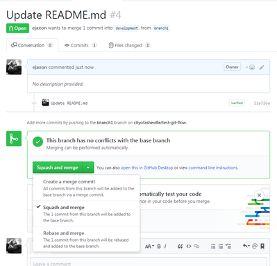

# Software Development Conventions and Procedures

## Github Workflow

Development of web applications at the City of Asheville uses a slightly modified variant of the GitFlow model, which you can read about here: http://nvie.com/posts/a-successful-git-branching-model/. The one difference from the procedure described there is that we squash commits from a feature (or hotfix) branch and merge into the development and/or master branches with a single commit message (we do __not__, however, squash commits when merging a release branch). 

There are two reasons for this. First, we __strongly__ disagree with the statements made about feature-branch changes only living in a developer's repository - changes should be regularly committed to the feature-branch in the main repository on Github. Second, the string of commits that are merged into the master branch as part of a release should have commit messages that naturally translate to release notes. That won't work if we have dozens of commit messages like 'Saving for the day.'

You may carry out this modified workflow on either the command line or in the Github UI. In either case, assume that you have created a feature branch called ```branch1``` from ```development``` and, after spending several days working, checking in changes to the branch regularly, are ready to merge it back into development.

### UI Procedure
1. Create a pull request from ```branch1``` back into ```development```.
2. Make sure you select _Squash and merge_ as shown below and write a commit message that describes the sum total change (i.e., appropriate for release notes).
3. After validating the merged feature, delete ```branch1```. Do not continue development on an already-merged feature branch - start a new one instead.



### Command Line
````
  git checkout development
  git merge --squash branch1
  git commit -m 'Final branch1 commit message'
  git push origin  development
````
